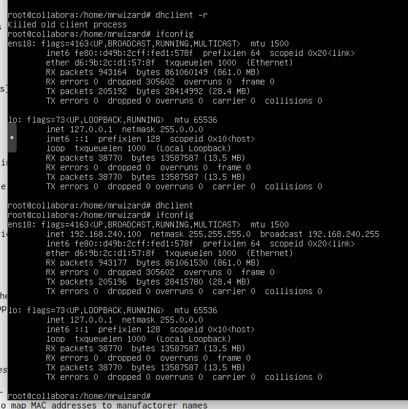

# mie-project

## New Virtual Machine Gets Lease from New DHCP Server


## DHCP Server Output
```
To get manufacturer names please download http://standards.ieee.org/regauth/oui/oui.txt to /usr/local/etc/oui.txt
Reading leases from /var/lib/dhcp/dhcpd.leases
MAC                IP              hostname       valid until         manufacturer
===============================================================================================
d6:9b:2c:d1:57:8f  192.168.240.100 collabora      2024-01-05 02:29:35 -NA-
```

## DHCP Server Logs
```
Jan 05 02:19:34 bitwarden dhcpd[90484]: DHCPDISCOVER from d6:9b:2c:d1:57:8f via ens18
Jan 05 02:19:35 bitwarden dhcpd[90484]: DHCPOFFER on 192.168.240.100 to d6:9b:2c:d1:57:8f (collabora) via ens18
Jan 05 02:19:35 bitwarden dhcpd[90484]: DHCPREQUEST for 192.168.240.100 (192.168.240.102) from d6:9b:2c:d1:57:8f (collabora) via ens18
Jan 05 02:19:35 bitwarden dhcpd[90484]: DHCPACK on 192.168.240.100 to d6:9b:2c:d1:57:8f (collabora) via ens18
```
